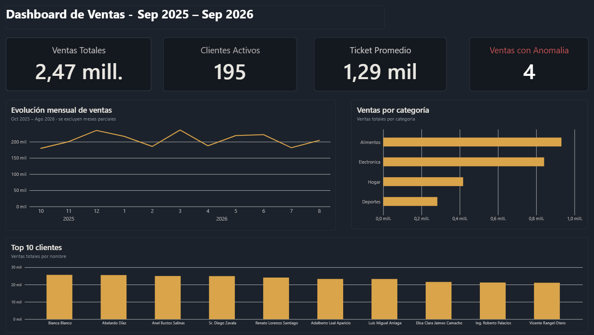
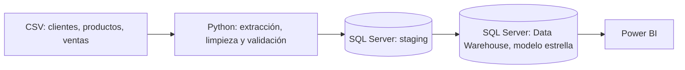

# Pipeline ETL de Ventas · Python + SQL Server + Power BI

Pipeline de datos de punta a punta: extrae datos de ventas desde archivos CSV, aplica reglas de calidad con Python (Pandas), los carga en un Data Warehouse con modelo estrella en SQL Server y los visualiza en un dashboard de Power BI. Se ejecuta de forma automática y deja registro de cada corrida.

> Los datos son sintéticos (generados con Faker) e incluyen errores intencionales para practicar limpieza y validación.



## Arquitectura



## Tecnologías

Python (Pandas, SQLAlchemy, pyodbc, Faker) · SQL Server (T-SQL, stored procedures) · Power BI (DAX) · Git/GitHub · Programador de tareas de Windows

## Estructura del repositorio

```
├── data/raw/          # CSVs fuente (generados)
├── scripts/           # Código Python del pipeline
├── sql/               # Scripts SQL numerados, en orden de ejecución
├── powerbi/           # Dashboard (.pbix) y tema
├── docs/              # Imágenes de documentación
├── run_etl.bat        # Lanzador para ejecución programada
└── requirements.txt
```

## Modelo de datos

Esquema estrella con llaves subrogadas:

- **DimCliente**, **DimProducto**, **DimFecha** (generada con un CTE recursivo)
- **FactVenta**: una fila por venta; guarda `precio_unitario` y `monto_total` como foto del momento de la venta, para no distorsionar el histórico si el precio de catálogo cambia.

## Calidad de datos

Los CSV incluyen errores intencionales. Las reglas se dividen en dos tipos:

| Tipo | Regla | Acción |
|---|---|---|
| Dura | Cliente con nombre nulo | Se elimina |
| Dura | Cliente o venta duplicados | Se elimina |
| Dura | Venta con `cliente_id` inexistente (huérfana) | Se elimina |
| Suave | Precio de producto negativo | Se conserva con `precio_valido = 0` |
| Suave | Cantidad de venta <= 0 | Se conserva con `cantidad_valida = 0` |

## Decisiones de diseño

- **Capa de staging sin restricciones:** recibe el dato crudo tal cual llega, lo que permite auditar qué trajo el origen. El modelo estrella sí aplica llaves foráneas.
- **Reglas duras vs. suaves:** lo que rompe la integridad referencial se elimina; lo que solo es sospechoso se marca para revisión sin perder el registro.
- **Efecto en cascada:** al eliminar clientes con nombre nulo, sus ventas quedan huérfanas y también se eliminan. Por eso el pipeline descarta más filas (4,1%) que los errores inyectados directamente en ventas. El orden de las reglas afecta el resultado.
- **Carga idempotente:** el stored procedure `usp_cargar_dw` solo inserta registros que no existen y corre dentro de una transacción (todo o nada). Ejecutar el pipeline varias veces no duplica datos.
- **Logging por niveles:** `INFO` para el progreso normal y `WARNING` para filas eliminadas o inválidas, con una alerta adicional si se descarta más del 3% de las ventas.

## Cómo ejecutarlo

Requisitos: Windows, SQL Server (Developer o Express), ODBC Driver 17 o 18 for SQL Server, Python 3.10+.

```bash
git clone https://github.com/veroagulr/etl-ventas-sqlserver-powerbi.git
cd etl-ventas-sqlserver-powerbi
python -m venv venv
venv\Scripts\activate
pip install -r requirements.txt
```

1. En SSMS, ejecuta en orden los scripts de `sql/` (del 01 al 04).
2. Ajusta servidor y driver en `scripts/conexion.py` si es necesario.
3. Genera los datos fuente: `python scripts/generar_datos.py`
4. Ejecuta el pipeline: `python scripts/etl_main.py`
5. Abre `powerbi/dashboard_ventas.pbix` y pulsa "Actualizar".

Los logs de cada ejecución quedan en `logs/`.

## Limitaciones y mejoras futuras

- Las dimensiones solo agregan registros nuevos; no versionan cambios históricos (SCD tipo 2).
- La ejecución depende de un equipo encendido; en producción se usaría un orquestador como Airflow o Azure Data Factory.
- Carga completa de staging en cada corrida; un siguiente paso es la carga incremental.
- Siguiente proyecto: extracción desde una API en lugar de CSV.

## Autora

Veronica Aguilar
